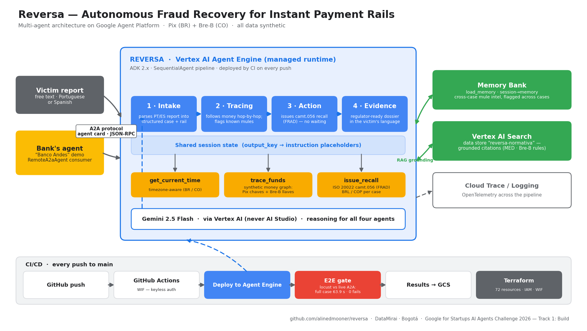

# Reversa

[](https://github.com/alinedmooner/reversa/actions/workflows/staging.yaml)

Autonomous fraud recovery on instant payment rails (Pix / Bre-B).
Multi-agent pipeline (ADK + A2A): intake → money tracing through mule accounts →
camt.056 blocking → auditable dossier grounded in regulation (Vertex AI Search) →
institutional mule intelligence (Memory Bank). The pipeline is rail-agnostic:
the same agents handle a Brazilian Pix case (in Portuguese) and a Colombian
Bre-B case (in Spanish) — only a thin data/config layer changes.

Scaffold generated with [`googleCloudPlatform/agent-starter-pack`](https://github.com/GoogleCloudPlatform/agent-starter-pack) `0.41.3` (`adk_a2a` template, GitHub Actions CI/CD). Engineering gotchas applied throughout are logged in [LESSONS.md](LESSONS.md) (in Spanish — the prototype's field notes).

## Why Reversa — the research

Instant payment rails (100+ jurisdictions live) settle in seconds and are irrevocable — and that combination created a crime that runs in minutes: authorized-push-payment fraud, where the victim is manipulated or coerced ("sequestro relâmpago") into sending the transfer themselves, and the money layers through 2–5 mule accounts before cashing out. Brazil measured what human-paced recovery achieves against that clock: the **MED** recovers **~7–14%** of stolen amounts depending on period and methodology — the BCB's **official 2025 figure is 7% of disputed value, with ~89% of refund requests denied**. **MED 2.0** (mandatory **Feb 2, 2026**) extends tracing to **five account layers** — institutional confirmation that recovery is a multi-hop tracing *and speed* problem, yet the loop still runs at human speed.

Colombia's **Bre-B** (live 2025, **200+ institutions**) launched with **no recovery mechanism at all**: disputes move at help-desk speed under SFC oversight, against a crime that moves at network speed. That asymmetry defines Reversa's two pilot markets — and its category: autonomous **recovery**, not prevention.

| | **Brazil / Pix** | **Colombia / Bre-B** |
|---|---|---|
| Recovery mechanism | MED (since 2021), MED 2.0 (mandatory Feb 2026, 5 account layers) | **None** |
| Measured recovery | ~7–14% (official 2025: **7% of disputed value**, ~89% of requests denied) | No standardized measurement |
| What Reversa is there | *The upgrade*: beat a mechanism that exists and underperforms | *The first mechanism*: greenfield |

→ Research: **[summary](docs/research.md)** · **[full investigation](docs/research-full.md)** (includes the global landscape of 100+ instant payment systems).

## Architecture



Four specialized agents run as one `SequentialAgent` pipeline on Vertex AI Agent Engine: **intake** structures the victim's report (rail + language detection), **tracing** follows the money hop-by-hop through the mule graph and checks the Memory Bank for known mules, **action** issues the ISO 20022 camt.056 recall, and **evidence** writes the regulator-grade dossier grounded in the normative corpus (Vertex AI Search). The pipeline is also exposed over the A2A protocol, so partner-bank agents (like the included `banco_andes` demo) can delegate cases to it.

## Project Structure

```
reversa/
├── app/         # Core agent code (pipeline, money graph, camt.056 recall, A2A server)
│   ├── agent.py               # Main agent logic
│   ├── agent_engine_app.py    # Agent Engine application logic
│   └── app_utils/             # App utilities and helpers
├── banco_andes/               # Fictional counterparty bank agent (A2A consumer demo)
├── docs/                      # Research + normative manual (Vertex AI Search corpus)
├── .github/                   # CI/CD pipeline configurations for GitHub Actions
├── deployment/                # Infrastructure and deployment scripts
├── notebooks/                 # Jupyter notebooks for prototyping and evaluation
├── tests/                     # Unit, integration, eval and load tests
├── GEMINI.md                  # AI-assisted development guide
├── Makefile                   # Development commands
└── pyproject.toml             # Project dependencies
```

> 💡 **Tip:** Use [Gemini CLI](https://github.com/google-gemini/gemini-cli) for AI-assisted development - project context is pre-configured in `GEMINI.md`.

## Requirements

Before you begin, ensure you have:
- **Python 3.13 + pip**: local dev uses a plain virtualenv (pyenv recommended); `uv` is only used by CI against the committed `uv.lock`
- **Google Cloud SDK**: For GCP services - [Install](https://cloud.google.com/sdk/docs/install) (project with Vertex AI + Vertex AI Search enabled)
- **Terraform**: For infrastructure deployment - [Install](https://developer.hashicorp.com/terraform/downloads)
- **make**: Build automation tool - [Install](https://www.gnu.org/software/make/) (pre-installed on most Unix-based systems)


## Quick Start

```bash
# 1) Python env (once): pyenv virtualenv 3.13.13 reversa && pyenv local reversa
# 2) Agent env vars — copy the examples and set your GCP project:
cp app/.env.example app/.env && cp banco_andes/.env.example banco_andes/.env
# 3) Install dependencies and launch the local playground (adk web):
make install && make playground
```

### Try it

**Primary case — Brazil / Pix** (the victim reports in Portuguese; the product answers in kind — that's a feature):

> Caí no golpe do falso parente, fiz um Pix de R$ 50.000 para a chave 123.456.789-09 há 10 minutos.

Expected: a complete dossier **in Portuguese** — intake JSON with `rail: PIX_BR`, the 3-hop chave trace (CPF → +55 phone → random EVP key) across fictional institutions, a **camt.056 recall in BRL** with its `message_id`, a next-step recommendation grounded in the **MED (Banco Central do Brasil)** context via Vertex AI Search, and the section-5 mule-intelligence list.

**Rail-agnostic proof — Colombia / Bre-B** (same agents, zero code changes):

> Me hicieron un secuestro relámpago, transferí $11.000.000 a la llave 3001234567 hace 10 minutos.

Expected: the dossier **in Spanish** — llave trace, **camt.056 in COP**, and a recommendation grounded in Bre-B's regulatory reality: **no MED equivalent, SFC oversight**.

## Commands

| Command              | Description                                                                                 |
| -------------------- | ------------------------------------------------------------------------------------------- |
| `make install`       | Install dependencies with pip (pyenv env `reversa`, Python 3.13)                            |
| `make playground`    | Launch local development environment                                                        |
| `make lint`          | Run code quality checks                                                                     |
| `make test`          | Run unit tests (no GCP needed)                                                              |
| `make test-integration` | Run integration tests (needs GCP project + Vertex auth)                                  |
| `make deploy`        | Deploy agent to Agent Engine                                                                |
| `make eval`          | Run the canonical-case evals (`adk eval`, judged on dossier rubrics)                        |
| `make inspector`     | Launch A2A Protocol Inspector (requires uv + npm; not converted to pip)                     |
| `make setup-dev-env` | Set up development environment resources using Terraform                                   |

For full command options and usage, refer to the [Makefile](Makefile).

## 🛠️ Project Management

| Command | What It Does |
|---------|--------------|
| `uvx agent-starter-pack setup-cicd` | One-command setup of entire CI/CD pipeline + infrastructure |
| `uvx agent-starter-pack upgrade` | Auto-upgrade to latest version while preserving customizations |
| `uvx agent-starter-pack extract` | Extract minimal, shareable version of your agent |

---

## Development

Edit your agent logic in `app/agent.py` and test with `make playground` - it auto-reloads on save.
Use notebooks in `notebooks/` for prototyping and Vertex AI Evaluation.
See the [development guide](https://googlecloudplatform.github.io/agent-starter-pack/guide/development-guide) for the full workflow.

## Deployment

```bash
gcloud config set project <your-project-id>
make deploy
```
Every push to `main` also deploys automatically via GitHub Actions (WIF, no service-account keys) — see `.github/workflows/staging.yaml`.

**Live deployment**: Agent Engine `reasoningEngines/4059650367179194368`, `us-central1`, project `reversa-datamirai` — [Console](https://console.cloud.google.com/vertex-ai/agents/agent-engines/locations/us-central1/agent-engines/4059650367179194368?project=reversa-datamirai) · [A2A agent card](https://us-central1-aiplatform.googleapis.com/v1beta1/projects/reversa-datamirai/locations/us-central1/reasoningEngines/4059650367179194368/a2a/v1/card) (requires a `gcloud auth print-access-token` bearer).

## Observability

Built-in telemetry exports to Cloud Trace, BigQuery, and Cloud Logging.
See the [observability guide](https://googlecloudplatform.github.io/agent-starter-pack/guide/observability) for queries and dashboards.

## A2A Inspector

This agent supports the [A2A Protocol](https://a2a-protocol.org/). Use `make inspector` to test interoperability.
See the [A2A Inspector docs](https://github.com/a2aproject/a2a-inspector) for details.

---

Built by Gabriel Cuadros & Daniel Moreno — DataMirai, Bogotá
